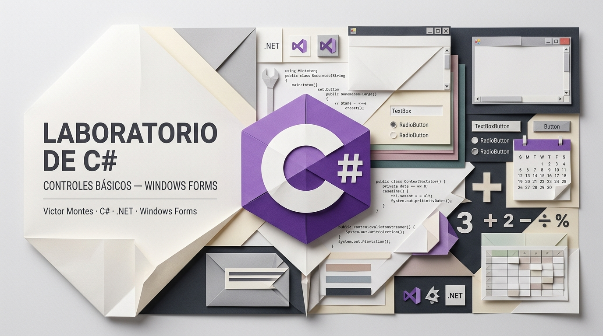
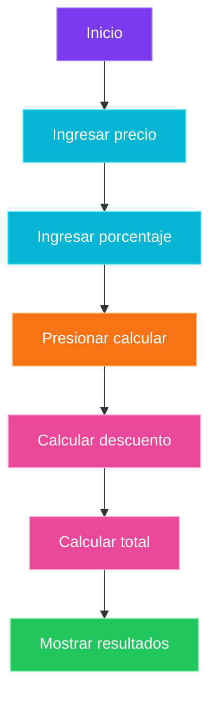
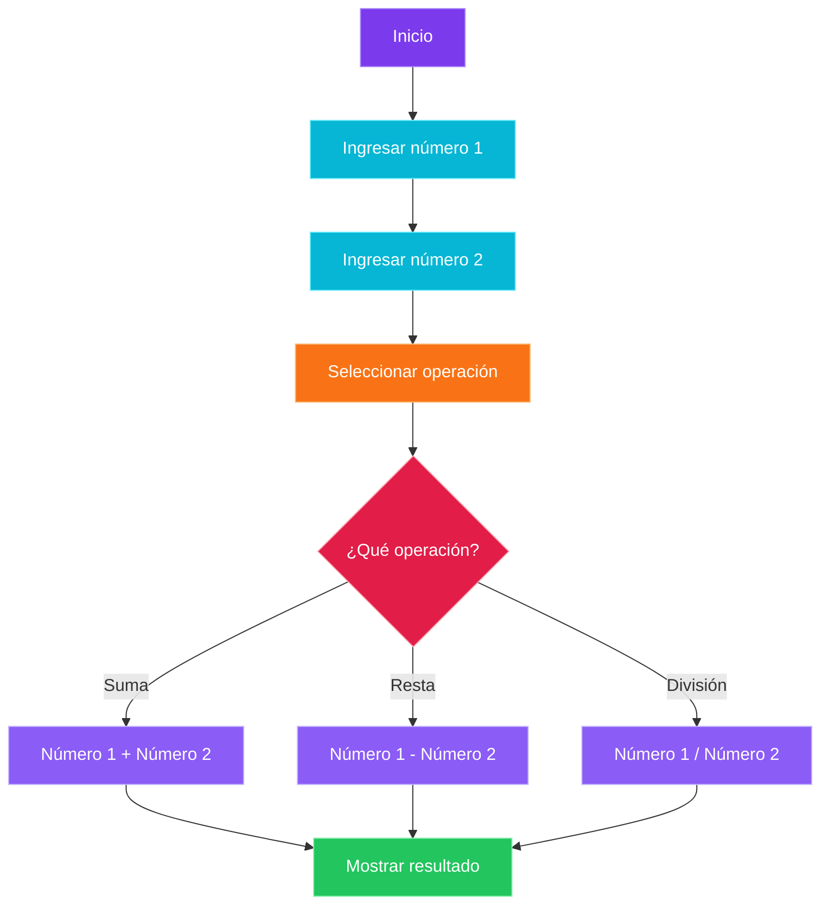
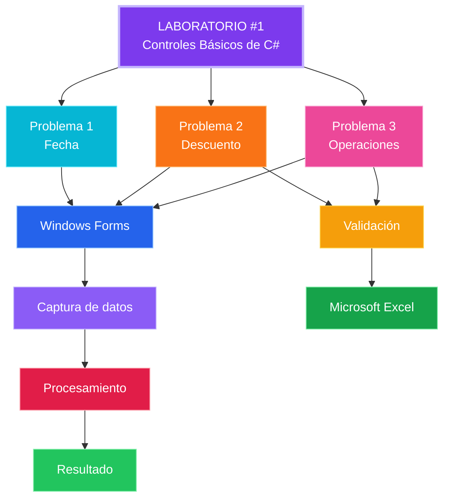
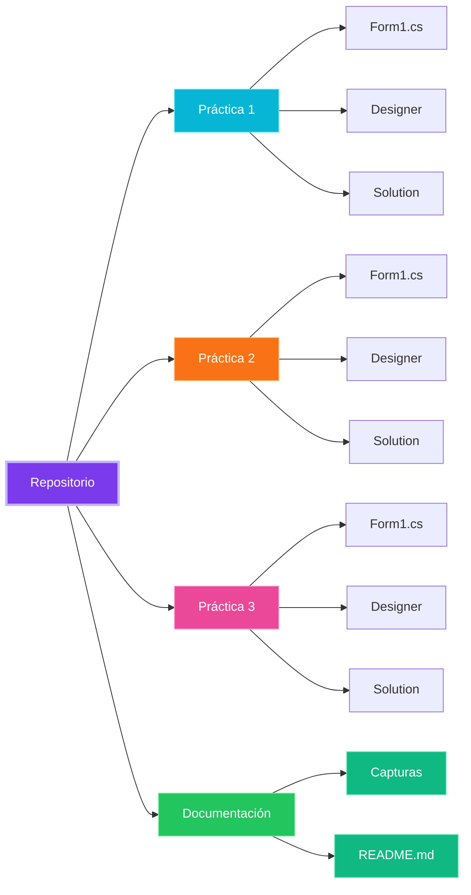

```mermaid
flowchart LR
    A["Inicio"] --> B["Ingresar día"]
    B --> C["Ingresar mes"]
    C --> D["Ingresar año"]
    D --> E["Presionar botón"]
    E --> F["Procesar datos"]
    F --> G["Mostrar fecha"]
    
    style A fill:#7C3AED,color:#fff,stroke:#A78BFA
    style B fill:#06B6D4,color:#fff,stroke:#67E8F9
    style C fill:#06B6D4,color:#fff,stroke:#67E8F9
    style D fill:#06B6D4,color:#fff,stroke:#67E8F9
    style E fill:#F97316,color:#fff,stroke:#FDBA74
    style F fill:#EC4899,color:#fff,stroke:#F9A8D4
    style G fill:#22C55E,color:#fff,stroke:#86EFAC
```

<div align="center">

# Laboratorio #1 — Controles Básicos de C#

### Aplicaciones Windows Forms con C#



**Universidad Tecnológica de Panamá · Facultad de Ingeniería de Sistemas Computacionales**

<br>


<br><br>


<br>

**Fecha de realización:** 16 de agosto de 2026

</div>
---

## Contenido

* [Descripción](#descripción)
* [Objetivos](#objetivos)
* [Tecnologías utilizadas](#tecnologías-utilizadas)
* [Descripción de las prácticas](#descripción-de-las-prácticas)
* [Capturas de pantalla y problemas](#capturas-de-pantalla-y-problemas)
* [Flujo general del laboratorio](#flujo-general-del-laboratorio)
* [Estructura del repositorio](#estructura-del-repositorio)
* [Comprobación mediante Excel](#comprobación-mediante-excel)
* [Requisitos](#requisitos)
* [Ejecución](#ejecución)
* [Autor y contexto académico](#autor-y-contexto-académico)

---

## Descripción

Este repositorio contiene el desarrollo del **Laboratorio #1 de Programación**, realizado utilizando el lenguaje **C#** y la tecnología **Windows Forms**.

La práctica está orientada al aprendizaje y aplicación de conceptos fundamentales relacionados con:

* Controles de interfaz gráfica.
* Captura de datos.
* Eventos de botones.
* Conversión de datos.
* Operaciones matemáticas.
* Cálculos porcentuales.
* Estructuras condicionales.
* Selección de opciones mediante `RadioButton`.
* Presentación de resultados.
* Validación de cálculos mediante Microsoft Excel.

El laboratorio está compuesto por **tres problemas independientes**, cada uno implementado como un proyecto de Windows Forms.

---

## Objetivos

### Objetivo general

Desarrollar aplicaciones gráficas sencillas utilizando **C# y Windows Forms**, aplicando controles básicos de interfaz y lógica de programación para resolver diferentes problemas.

### Objetivos específicos

* Utilizar controles básicos de Windows Forms.
* Capturar información introducida por el usuario.
* Manipular valores numéricos.
* Realizar operaciones aritméticas.
* Implementar cálculos de porcentajes.
* Utilizar botones para ejecutar acciones.
* Utilizar `RadioButton` para seleccionar operaciones.
* Mostrar resultados dinámicamente.
* Aplicar estructuras condicionales.
* Verificar los resultados obtenidos mediante Microsoft Excel.

---

## Tecnologías utilizadas

<div align="center">

|                                    Tecnología                                   | Utilización         |
| :-----------------------------------------------------------------------------: | ------------------- |
|                         | **C#**              |
|                     | **.NET**            |
|               | **Visual Studio**   |
|                        | **Git**             |
|                     | **GitHub**          |
|  | **Microsoft Excel** |

</div>

### Stack tecnológico

```text
┌─────────────────────────────────────────────────────┐
│                  LABORATORIO #1                     │
├─────────────────────────────────────────────────────┤
│                                                     │
│  Lenguaje             C#                            │
│                                                     │
│  Plataforma            .NET                         │
│                                                     │
│  Interfaz              Windows Forms                │
│                                                     │
│  IDE                   Visual Studio                │
│                                                     │
│  Control de versiones  Git / GitHub                 │
│                                                     │
│  Validación            Microsoft Excel              │
│                                                     │
└─────────────────────────────────────────────────────┘
```

---

# Descripción de las prácticas

## Problema 1 — Ingreso y visualización de una fecha

La primera práctica consiste en desarrollar una interfaz que permita al usuario introducir una fecha mediante diferentes campos.

El formulario solicita:

* Día.
* Mes.
* Año.

Posteriormente, mediante un botón, los valores introducidos son procesados y la fecha es mostrada al usuario.

### Flujo de funcionamiento



### Conceptos aplicados

* `TextBox`
* `Button`
* Captura de datos
* Conversión de valores
* Manipulación de información
* Eventos de Windows Forms

---

## Problema 2 — Cálculo de descuento

La segunda práctica desarrolla una aplicación capaz de calcular el descuento aplicado sobre el precio de un producto.

El usuario proporciona:

* Precio.
* Porcentaje de descuento.

El programa calcula automáticamente:

1. El valor monetario del descuento.
2. El precio final a pagar.

### Fórmula del descuento

```text
Descuento = Precio × (Porcentaje / 100)
```

### Fórmula del precio final

```text
Total = Precio - Descuento
```

### Flujo de funcionamiento



### Ejemplo

```text
Precio:       $100.00
Descuento:       15%

Descuento:     $15.00
Total:         $85.00
```

### Conceptos aplicados

* `TextBox`
* `Button`
* Variables numéricas
* Porcentajes
* Operaciones aritméticas
* Conversión de datos
* Presentación de resultados

---

## Problema 3 — Operaciones matemáticas

La tercera práctica permite realizar diferentes operaciones matemáticas utilizando dos números introducidos por el usuario.

Las operaciones implementadas son:

| Operación | Expresión           |
| --------- | ------------------- |
| Suma      | `Número1 + Número2` |
| Resta     | `Número1 - Número2` |
| División  | `Número1 / Número2` |

La operación es seleccionada mediante controles `RadioButton`.

### Flujo de funcionamiento



### Consideración importante

En la operación de división debe evitarse que el segundo número sea `0`, ya que no es posible realizar una división entre cero.

---

# Capturas de pantalla y problemas

Las siguientes capturas corresponden a la ejecución de cada uno de los problemas desarrollados durante el laboratorio.

---

## Interfaz — Problema 1

### Ingreso y visualización de fecha


**Descripción:**
Interfaz desarrollada en Windows Forms para ingresar día, mes y año, y posteriormente mostrar la fecha resultante.

---

## Interfaz — Problema 2

### Cálculo de descuento


**Descripción:**
Interfaz encargada de recibir el precio y el porcentaje de descuento para calcular el valor descontado y el total final.

---

## Interfaz — Problema 3

### Operaciones matemáticas


**Descripción:**
Interfaz que permite ingresar dos valores y seleccionar mediante `RadioButton` la operación matemática que se desea ejecutar.

---

# Flujo general del laboratorio

El funcionamiento general del laboratorio puede representarse mediante el siguiente flujo:



---

# Estructura del repositorio

El repositorio está organizado en tres proyectos independientes correspondientes a las prácticas del laboratorio.

```text
LABORATORIO-CONTROLES-BASICOS-DE-C-SHARP-Victor-Montes/
│
├── README.md
│
├── Pract1 - Controles - Victor Montes/
│   │
│   ├── Pract1-Controles.slnx
│   │
│   └── Pract1-Controles/
│       ├── Form1.cs
│       ├── Form1.Designer.cs
│       ├── Form1.resx
│       ├── Program.cs
│       └── Pract1-Controles.csproj
│
├── Pract2 - ProyectoDescuento - Victor_Montes/
│   │
│   ├── ProyectoDescuento - Victor_Montes.slnx
│   │
│   └── ProyectoDescuento - Victor_Montes/
│       ├── Form1.cs
│       ├── Form1.Designer.cs
│       ├── Form1.resx
│       ├── Program.cs
│       └── ProyectoDescuento - Victor_Montes.csproj
│
├── Pract3 - EstructuraIf 3 - Victor Montes/
│   │
│   ├── Pract8-EstructuraIf 3 - Victor Montes.slnx
│   │
│   └── Pract8-EstructuraIf 3 - Victor Montes/
│       ├── Form1.cs
│       ├── Form1.Designer.cs
│       ├── Form1.resx
│       ├── Program.cs
│       └── Pract8-EstructuraIf 3 - Victor Montes.csproj
│
└── docs/
    └── images/
        ├── problema-1.png
        ├── problema-2.png
        └── problema-3.png
```

### Organización lógica



---

# Comprobación mediante Excel

Como complemento del laboratorio, se utilizó **Microsoft Excel** para comprobar los resultados obtenidos en determinadas operaciones.

La validación permite comparar los resultados producidos por el programa con cálculos independientes.

### Operaciones verificadas

```text
                    VALIDACIÓN
                        │
             ┌──────────┴──────────┐
             │                     │
        Problema 2             Problema 3
             │                     │
             ▼                     ▼
       Descuento               Suma
       Total final             Resta
                               División
             │                     │
             └──────────┬──────────┘
                        ▼
                Microsoft Excel
                        │
                        ▼
                 Comparación
                        │
                        ▼
                Resultado válido
```

---

# Requisitos

Para ejecutar los proyectos se requiere un entorno compatible con aplicaciones Windows Forms desarrolladas en C#.

### Software

* Windows.
* Visual Studio.
* .NET compatible con el proyecto.
* Microsoft Excel para consultar la validación de resultados.

### Conocimientos recomendados

* Fundamentos de programación.
* Variables.
* Operadores aritméticos.
* Estructuras condicionales.
* Eventos.
* C# básico.
* Conceptos básicos de Windows Forms.

---

# Ejecución

## 1. Clonar el repositorio

```bash
git clone https://github.com/VITIDEV06/LABORATORIO-CONTROLES-BASICOS-DE-C-SHARP-Victor-Montes.git
```

## 2. Acceder al repositorio

```bash
cd LABORATORIO-CONTROLES-BASICOS-DE-C-SHARP-Victor-Montes
```

## 3. Abrir el proyecto

Abrir cualquiera de las tres soluciones `.slnx` utilizando **Visual Studio**.

```text
Pract1 - Controles - Victor Montes/
Pract2 - ProyectoDescuento - Victor_Montes/
Pract3 - EstructuraIf 3 - Victor Montes/
```

## 4. Compilar

Desde Visual Studio:

```text
Build
   ↓
Build Solution
```

## 5. Ejecutar

Ejecutar la aplicación utilizando:

```text
Start
```

o mediante:

```text
F5
```

---

# Controles de Windows Forms utilizados

El laboratorio permite trabajar con diferentes controles básicos de la interfaz gráfica.

| Control       | Función                            |
| ------------- | ---------------------------------- |
| `TextBox`     | Entrada de información             |
| `Label`       | Presentación de texto              |
| `Button`      | Ejecución de acciones              |
| `RadioButton` | Selección de una operación         |
| `Form`        | Ventana principal de la aplicación |

---

# Conceptos de programación aplicados

```mermaid
mindmap
  root((C# Windows Forms))
    Interfaz gráfica
      Form
      Label
      TextBox
      Button
      RadioButton
    Entrada
      Datos del usuario
      Conversión numérica
    Procesamiento
      Operaciones aritméticas
      Porcentajes
      Condicionales
    Salida
      Resultados
      Mensajes
    Validación
      Microsoft Excel
      Comparación de resultados
```



---

# Resumen de las prácticas

|  #  | Práctica    | Conceptos principales                     |
| :-: | ----------- | ----------------------------------------- |
|  01 | Fecha       | Entrada de datos y presentación           |
|  02 | Descuento   | Porcentajes y operaciones matemáticas     |
|  03 | Operaciones | `RadioButton`, condicionales y aritmética |

---

# Resultado del laboratorio

El laboratorio permitió implementar tres aplicaciones gráficas independientes utilizando C# y Windows Forms.

```text
                   LABORATORIO #1
                         │
           ┌─────────────┼─────────────┐
           │             │             │
           ▼             ▼             ▼
       PROBLEMA 1    PROBLEMA 2    PROBLEMA 3
           │             │             │
         FECHA        DESCUENTO    OPERACIONES
           │             │             │
           └─────────────┼─────────────┘
                         │
                         ▼
                WINDOWS FORMS
                         │
                         ▼
                  C# + .NET
                         │
                         ▼
                  RESULTADOS
                         │
                         ▼
                VALIDACIÓN EXCEL
```

---

# Autor y contexto académico

<div align="center">

### Victor Montes

**Universidad Tecnológica de Panamá (UTP)**

**Facultad de Ingeniería de Sistemas Computacionales**

**Laboratorio #1 — Controles Básicos de C#**

**Fecha de realización:** 16 de agosto de 2026

<br>


</div>

---

# Referencia

Este repositorio corresponde al desarrollo académico del **Laboratorio #1 de Controles Básicos de C#**, realizado como parte de las actividades prácticas de programación de la **Universidad Tecnológica de Panamá**.

---

<div align="center">

**C# · .NET · Windows Forms · Visual Studio · Git · GitHub**

<br>

Desarrollado por **Victor Montes**

</div>
